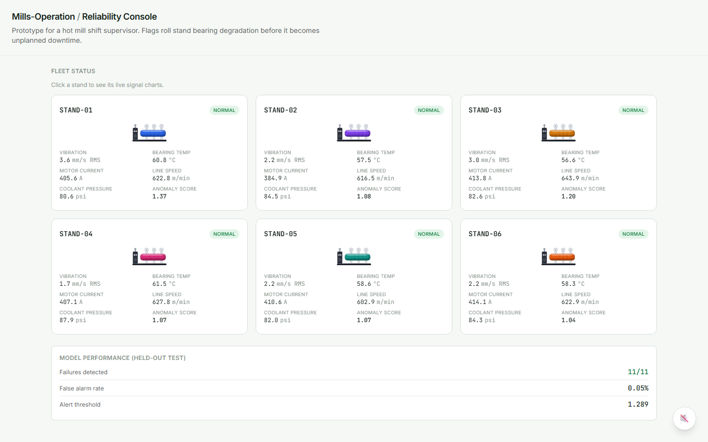
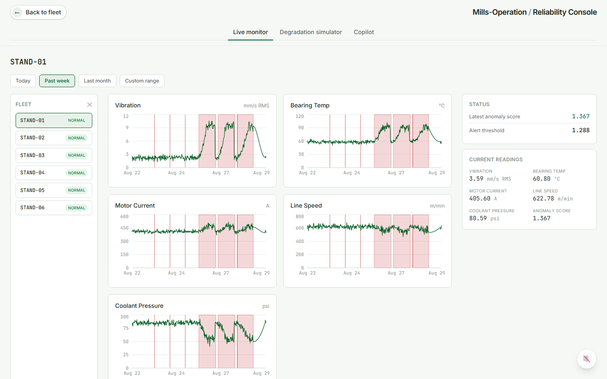
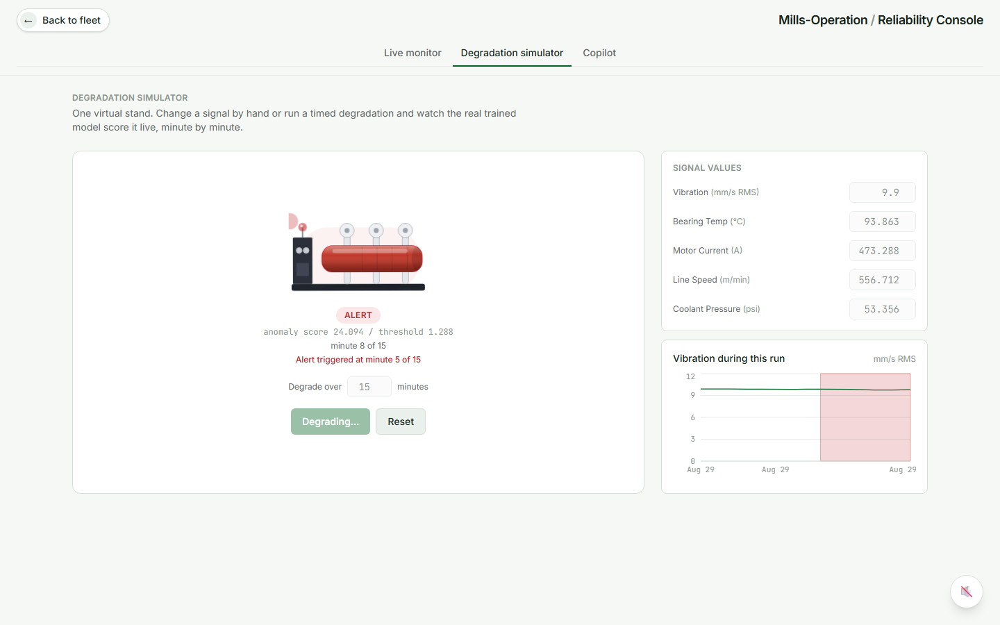
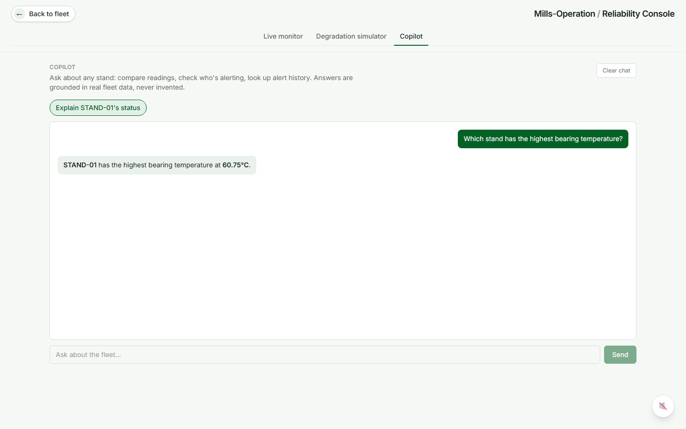
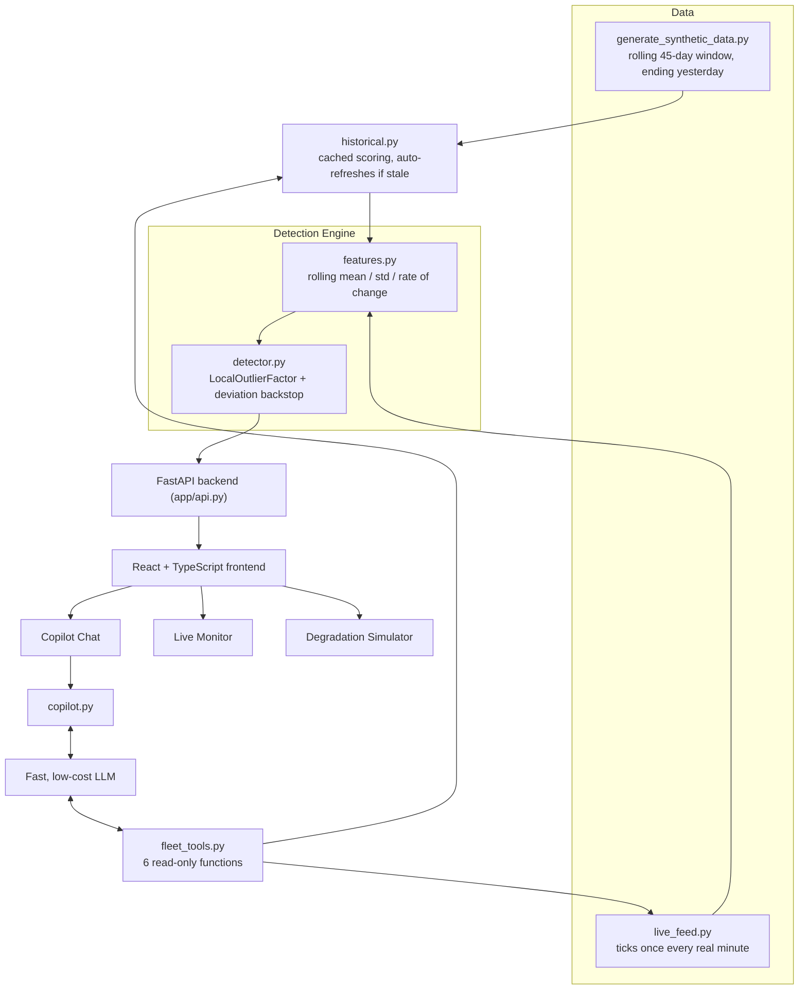

# Mills-Operation

**An AI-powered reliability copilot for hot mill operations.** Catches roll stand bearing degradation before it becomes unplanned downtime, and lets a shift supervisor ask a real AI copilot about the fleet in plain English.

[](https://github.com/zeeza18/Mills-Operation/actions/workflows/ci.yml)
[](LICENSE)
[](requirements.txt)
[](web/package.json)
[](web/tsconfig.json)
[](docs/copilot-how-it-works.md)



## Overview

A shift supervisor watching a hot mill line needs one thing: to know a bearing is failing before it takes the line down. This project trains a real anomaly detector on realistic sensor signatures, runs it against a continuously ticking live feed, and wraps the whole thing in a console a supervisor would actually want to use, including an AI copilot they can ask real questions.

Every number on this dashboard is real output from a trained model, not a mockup. 11 out of 11 injected failures caught on held-out data, with a 0.05% false alarm rate. See [`docs/architecture.md`](docs/architecture.md) for the full design story, including what didn't work the first time.

## Table of Contents

- [What it does](#what-it-does)
- [Screenshots](#screenshots)
- [Architecture](#architecture)
- [Tech stack](#tech-stack)
- [Getting started](#getting-started)
- [Testing](#testing)
- [Project structure](#project-structure)
- [Documentation](#documentation)
- [Known limitations](#known-limitations)

## What it does

| | |
|---|---|
| **Live Monitor** | 6 roll stands, ticking once every real minute, scored live by the trained detector. Filter by today, past week, last month, or a custom range reaching back through the training data. |
| **Degradation Simulator** | A virtual stand you control directly. Push any sensor toward failure by hand (the other four auto-correlate along the same curve real bearings follow), run a timed degradation, and watch the real model score it minute by minute. |
| **Fleet Copilot** | A real chat, not a canned FAQ. Ask it to compare stands, find who's alerting, check alert history, or predict who's trending toward trouble next, grounded in live data through 6 read-only tool calls, never invented. |
| **Real detection, not a demo dataset** | LocalOutlierFactor trained on a realistic non-linear bearing-wear signature, picked after an actual bake-off against 4 other models (see [`notebooks/model_comparison.ipynb`](notebooks/model_comparison.ipynb)), with an independent backstop for the model's own blind spot on sustained failures. |

## Screenshots

<table>
<tr>
<td width="50%">

**Live signal charts, with real alert history**


</td>
<td width="50%">

**Degradation simulator, live model response**


</td>
</tr>
</table>

**Fleet copilot, answering from real data**


## Architecture



The AI copilot doesn't use embeddings or a vector database. With only 6 stands, the entire fleet's current state trivially fits in a single prompt, so it's given 6 narrow, read-only Python functions instead (current reading, alert history, trend direction, and so on) and decides which ones a question actually needs. Full writeup in [`docs/copilot-how-it-works.md`](docs/copilot-how-it-works.md).

## Tech stack

| Layer | Choice | Why |
|---|---|---|
| Data generation | Python, pandas, numpy | Deterministic, seeded, reproducible without a 25MB file in git history |
| Anomaly detection | scikit-learn, LocalOutlierFactor | Won an actual bake-off against IsolationForest, OneClassSVM, and EllipticEnvelope, not picked by reasoning alone |
| Backend | FastAPI | Serves scored data, runs the live feed as a background task, proxies the copilot |
| Frontend | React 19, TypeScript, Vite, Tailwind CSS v4 | A real supervisor-facing tool, not a script re-running top to bottom on every click |
| Charts | Recharts | Alert bands as shaded regions, not thousands of individual markers |
| AI copilot | A fast, low-cost LLM, tool use | Fast and cheap for grounded, short explanations; tool use over RAG since the underlying data is small and structured |
| Testing | Playwright | Core flows gated in CI on every push |
| CI | GitHub Actions | Generate data, train, evaluate, test, gate on all of it |

Full justification for every choice, including what was rejected and why, in [`docs/stack-justification.md`](docs/stack-justification.md).

## Getting started

```bash
# Python backend
pip install -r requirements.txt

# 1. Generate the synthetic sensor dataset (deterministic, ~389K rows, a few seconds)
python data/generate_synthetic_data.py

# 2. Train the anomaly detector and score the held-out test window
python -m app.evaluate

# 3. Start the backend API (also starts the live feed in the background)
uvicorn app.api:app --reload --port 8000
```

```bash
# React frontend, in a second terminal
cd web
npm install
npm run dev
```

Open `http://localhost:5173`. The frontend expects the API at `http://localhost:8000` by default (override with `VITE_API_URL` in `web/.env.local`).

### Enabling the AI copilot

```bash
cp .env.example .env   # then put a real ANTHROPIC_API_KEY in .env
```

Without a key, both the single-stand explanation and the fleet chat still work, they fall back to a deterministic, data-grounded response instead of a live model call, so the dashboard never breaks because of a missing key or a network blip.

## Testing

```bash
npm install
npx playwright install --with-deps chromium
npx playwright test
```

Playwright builds and starts both the backend and the frontend itself (see `playwright.config.js`), so just make sure the two setup steps above have been run first. Runs automatically on every push and PR via `.github/workflows/ci.yml`.

## Project structure

```
app/       anomaly detection engine, live feed, simulator, AI copilot, FastAPI backend
web/       React + TypeScript frontend
tests/     Playwright test suite
data/      synthetic dataset generator
notebooks/ model comparison bake-off
docs/      architecture, stack justification, AI partnership log, data strategy, security & risk
scripts/   one-off utilities (README screenshot capture)
```

## Documentation

| Doc | What's in it |
|---|---|
| [`docs/architecture.md`](docs/architecture.md) | System design, key decisions, what breaks at Nucor scale |
| [`docs/copilot-how-it-works.md`](docs/copilot-how-it-works.md) | How the AI copilot actually works, in plain English |
| [`docs/stack-justification.md`](docs/stack-justification.md) | Why this stack, and why not C3.ai or Palantir Foundry |
| [`docs/ai-partnership-log.md`](docs/ai-partnership-log.md) | How AI was used building this, including every override and every real bug it took to get here |
| [`docs/data-strategy.md`](docs/data-strategy.md) | The synthetic data approach, and what real data this would need in production |
| [`docs/security-risk.md`](docs/security-risk.md) | Risk assessment, including the AI copilot's specific guardrails |

## Known limitations

- One global anomaly threshold across all 6 stands, not per-stand calibration
- Trained and evaluated entirely on synthetic data; see [`docs/data-strategy.md`](docs/data-strategy.md) for what's unverified
- Targets one failure mode (roll stand bearing degradation) by design, not general downtime prediction
- The live feed is a single in-process background task with an in-memory buffer, not production-scale streaming

Full breakdown, including what this would take to fix at scale, in [`docs/architecture.md`](docs/architecture.md).

---

Built as a take-home assignment, doubling as a demonstration of AI-assisted engineering: real ML evaluation, a real bug list, and an AI partnership log that says what actually happened, not what looks good.
